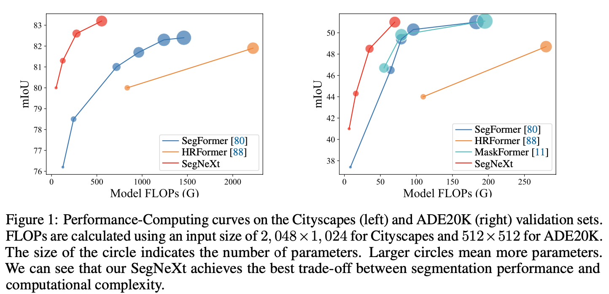

# SegNeXt: Rethinking Convolutional Attention Design for Semantic Segmentation (NeurIPS 2022)



The repository contains official Pytorch implementations of training and evaluation codes and pre-trained models for **SegNext**. 

The paper is in [Here](https://arxiv.org/pdf/2209.08575.pdf).

The code is based on [MMSegmentaion v0.24.1](https://github.com/open-mmlab/mmsegmentation/tree/v0.24.1).


## Citation
If you find our repo useful for your research, please consider citing our paper:

```
@article{guo2022segnext,
  title={SegNeXt: Rethinking Convolutional Attention Design for Semantic Segmentation},
  author={Guo, Meng-Hao and Lu, Cheng-Ze and Hou, Qibin and Liu, Zhengning and Cheng, Ming-Ming and Hu, Shi-Min},
  journal={arXiv preprint arXiv:2209.08575},
  year={2022}
}


@article{guo2022visual,
  title={Visual Attention Network},
  author={Guo, Meng-Hao and Lu, Cheng-Ze and Liu, Zheng-Ning and Cheng, Ming-Ming and Hu, Shi-Min},
  journal={arXiv preprint arXiv:2202.09741},
  year={2022}
}


@inproceedings{
    ham,
    title={Is Attention Better Than Matrix Decomposition?},
    author={Zhengyang Geng and Meng-Hao Guo and Hongxu Chen and Xia Li and Ke Wei and Zhouchen Lin},
    booktitle={International Conference on Learning Representations},
    year={2021},
}

```

## Results

**Notes**: ImageNet Pre-trained models can be found in [TsingHua Cloud](https://cloud.tsinghua.edu.cn/d/c15b25a6745946618462/).

## Rank 1 on Pascal VOC dataset: [Leaderboard](http://host.robots.ox.ac.uk:8080/leaderboard/displaylb_main.php?challengeid=11&compid=6)


## Installation
Install the dependencies and download ADE20K according to the guidelines in [MMSegmentation](https://github.com/open-mmlab/mmsegmentation/blob/v0.24.1/docs/en/get_started.md#installation).


```
pip install timm
cd SegNeXt
python setup.py develop
```

## Training

We use 8 GPUs for training by default. Run:

```bash
./tools/dist_train.sh /path/to/config 8
```

## Evaluation

To evaluate the model, run:

```bash
./tools/dist_test.sh /path/to/config /path/to/checkpoint_file 8 --eval mIoU
```

## FLOPs

Install torchprofile using

```bash
pip install torchprofile
```

To calculate FLOPs for a model, run:

```bash
bash tools/get_flops.py /path/to/config --shape 512 512
```

## Contact

For technical problem, please create an issue.

If you have any private question, please feel free to contact me via gmh20@mails.tsinghua.edu.cn.


## Acknowledgment

Our implementation is mainly based on [mmsegmentaion](https://github.com/open-mmlab/mmsegmentation/tree/v0.24.1), [Segformer](https://github.com/NVlabs/SegFormer) and [Enjoy-Hamburger](https://github.com/Gsunshine/Enjoy-Hamburger). Thanks for their authors.

## LICENSE

This repo is under the Apache-2.0 license. For commercial use, please contact the authors.
